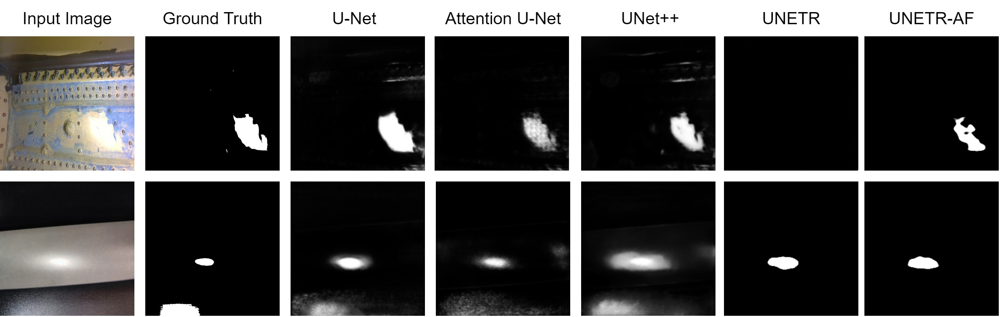
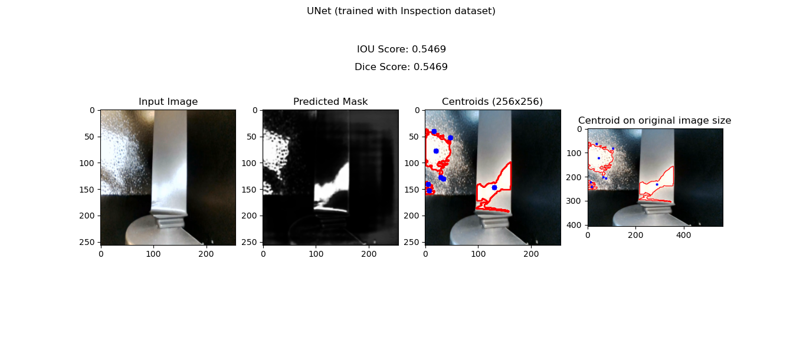
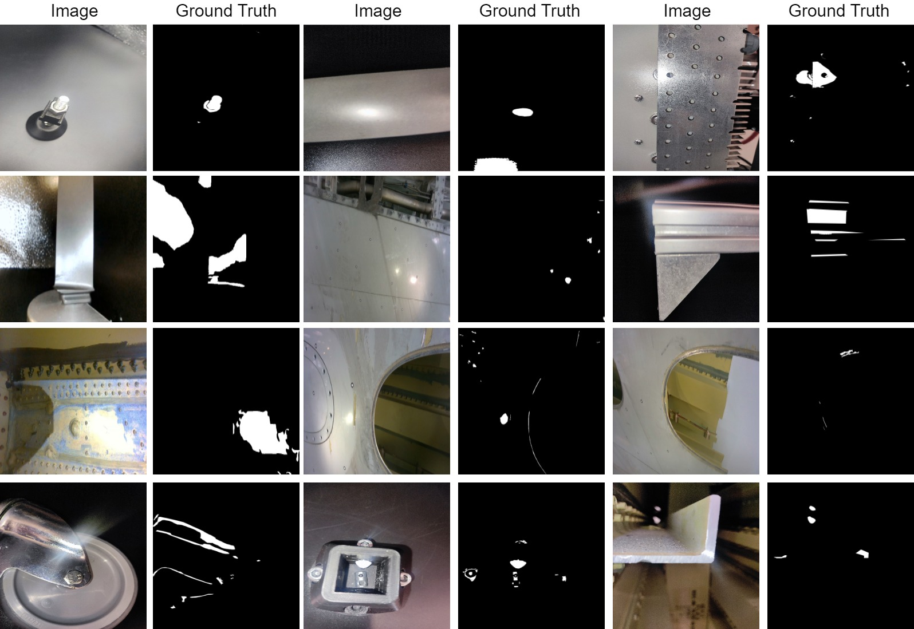

# Detection of Light Reflections

This repository contains the code to detect light reflections for reactive planning in autonomous inspections. The focus of this project is semantic segmentation methods by using deep-learning based methdologies. 




The objective of this thesis is to detect light reflections and aid in the reactive planning of autonomous inspections. Based on the semantic segmentation models (whose results are shown above), the coordinates of the reflections are calculated and returned in the post-processing. 

The results after inference are depicted on a sample image below:



## Run Code 

To run the code create a virtual enviroment and install the dependencies in requirements.txt:

```
python3 -m venv .myenv
source .myenv/bin/activate
pip3 install -r requirements.txt

```

To use the pre-trained models, download them from [here](https://drive.google.com/drive/folders/1kYJyP2MVlhWLJe_X5aZEwuN0GBzBqbgF?usp=sharing). <br>
Model Link: https://drive.google.com/drive/folders/1kYJyP2MVlhWLJe_X5aZEwuN0GBzBqbgF?usp=sharing 

To visualize the reflections and get the coordinates:
- Run [inference.py](./inference.py)

<h4>Please remember to change the model directory path before running the inference file</h4>

## Deep Learning Methods

Deep learning methods refer to a subset of machine learning techniques that use neural networks with multiple layers to model and learn from large amounts of data. This method is useful for semantic segmentation where the image needs to be partioned and assigned to a class. In this project, the models generate a binary image, with reflection areas marked as white and non-reflected areas as black. 

There are five models implemented (across three datasets: Inspection (see below), [SHIQ](https://github.com/fu123456/SHIQ), and [WHU](https://github.com/fu123456/SHDNet)):
- U-Net
- Attention U-Net
- U-Net++
- [UNETR](./unetr_new.py) 
- [UNETR-Attention Fusion (UNETR-AF)](./unetr_af.py)

Note:
- U-Net and Attention U-Net are saved in [model.py](./model.py)
- U-Net++ is imported from the segmentation model library
- UNETR and UNETR-AF have their own files

### Inspection Dataset

A specialized dataset consisting of 1025 inspection images is created for this thesis. The images are captured under varying light conditions and a corresponding masks is generated to highlight the reflections. The dataset is split into Train (820 images) and Test (205 images). 

Inspection Dataset can be downloaded from this [link](https://drive.google.com/file/d/1FzyrttkGKHhnGcS5mVw2aJNArD4PV-Xl/view?usp=drive_link) <br>
Link: https://drive.google.com/file/d/1FzyrttkGKHhnGcS5mVw2aJNArD4PV-Xl/view?usp=drive_link 



***

